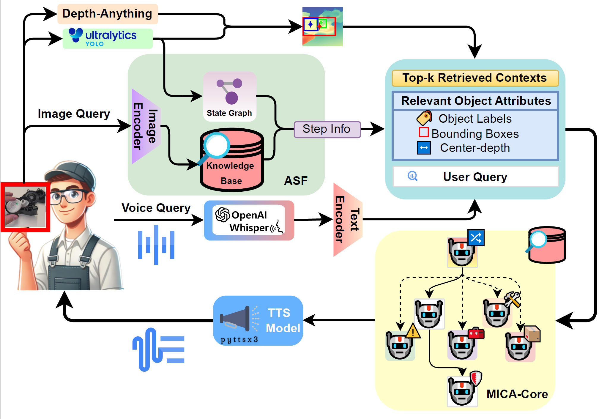

<div align="center">
  <h1>MICA: Multi-Agent Industrial Coordination Assistant</h1>

<div>
  <a href='https://scholar.google.com/citations?hl=en&oi=ao&user=aqGMqEcAAAAJ' target='_blank'>Di Wen</a>&emsp;
  <a href='https://scholar.google.com/citations?hl=en&user=pA9c0YsAAAAJ' target='_blank'>Kunyu Peng&#8224;</a>&emsp;
  <a href='https://junweizheng93.github.io/' target='_blank'>Junwei Zheng</a>&emsp;
  <a href='https://scholar.google.com/citations?hl=en&user=nG2ebe8AAAAJ' target='_blank'>Yufan Chen</a>&emsp;
  <a href='https://scholar.google.com/citations?hl=en&user=DqU2TTEAAAAJ' target='_blank'>Yitian Shi</a>&emsp;
  <a href='https://scholar.google.com/citations?hl=en&user=dVpZgIUAAAAJ' target='_blank'>Jiale Wei</a>&emsp;
  <a href='https://scholar.google.com/citations?hl=en&user=tJYUHDgAAAAJ' target='_blank'>Ruiping Liu</a>&emsp;
  <br>
  <a href='https://yangkailun.com/' target='_blank'>Kailun Yang</a>&emsp;
  <a href='https://scholar.google.com/citations?hl=en&user=SFCOJxMAAAAJ' target='_blank'>Rainer Stiefelhagen</a>
</div>

<br>

<strong>Accepted to <a href='https://2026.ieee-icra.org/' target='_blank'>IEEE ICRA 2026</a></strong><br>
<sub>&#8224; Corresponding author</sub><br><br>

[](https://arxiv.org/abs/2509.15237)
[](https://doi.org/10.48550/arXiv.2509.15237)
[](https://www.python.org/)
[](LICENSE)
[](https://github.com/Kratos-Wen/MICA)
[](https://github.com/Kratos-Wen/MICA/forks)
</div>

<p align="center">
  
</p>

## Overview

This repository provides the open-source implementation of the MICA pipeline.
The codebase is organized around the three method components described in the paper:

- `Depth-guided Object Context Extraction`
- `Adaptive Assembly Step Recognition`
- `MICA-core`

The implementation supports both offline video evaluation and live camera inference.

## Path Configuration Notice

- Every path written as `/path/to/...` is a placeholder.
- Replace these placeholders with paths on your own machine before running.
- This repository already includes `dataset/components.json`, `dataset/KB.json`, and `checkpoint/best.pt`.

## Setup

### 1. Create an Environment

Create and activate a clean conda environment, then install dependencies:

```bash
conda create -n mica python=3.10 -y
conda activate mica
pip install -U pip
pip install -r mica/requirements.txt
```

### 2. Prepare Required Assets

Bundled in this repository:

- `checkpoint/best.pt`
- `dataset/components.json`
- `dataset/KB.json`

Prepare the following input before testing:

- an offline video for evaluation, or a valid camera index for live mode

Optional assets:

- a retrieval gallery organized by step folders
- a local LLM endpoint for MICA-core question answering

If `gallery.root` is left empty in the config, the runtime skips gallery indexing and still runs.

## Run

Run from the repository root.

### Offline Video

```bash
python -m mica \
  --video /path/to/video.mp4 \
  --kb dataset/components.json \
  --yolo-weights checkpoint/best.pt \
  --config mica/resources/config.example.yaml \
  --device cpu
```

### Live Camera

```bash
python -m mica \
  --camera 0 \
  --kb dataset/components.json \
  --yolo-weights checkpoint/best.pt \
  --config mica/resources/config.example.yaml \
  --device cpu \
  --interactive
```

If `--kb` is omitted, the CLI first uses `dataset/components.json`. If `--yolo-weights` is omitted, it first uses `checkpoint/best.pt`.

## Runtime Controls

Live mode supports the following keyboard controls:

- `Q`: quit
- `P` or `Space`: pause or resume
- `F`: request a console feedback or QA prompt on the next stable step
- `H`: toggle the help overlay

## Ablation

The CLI exposes component-level ablations directly:

- `--disable-depth-context`
- `--disable-state-graph-expert`
- `--disable-retrieval-expert`
- `--disable-asf`
- `--disable-mica-core`
- `--agent-topology {mica,shared,central,hier,debate}`

Example:

```bash
python -m mica \
  --video /path/to/video.mp4 \
  --kb dataset/components.json \
  --yolo-weights checkpoint/best.pt \
  --disable-retrieval-expert
```

## Output

Each run writes structured artifacts to the configured output directory, including:

- `iterations.jsonl`
- `summary.csv`
- `feedback_log.jsonl`
- `manifest.json`
- optional annotated video
- persistent ASF weights

## Gear8 Dataset

The Gear8 dataset used in this work will be released on Hugging Face.

- Download link: **[Coming soon](https://huggingface.co/datasets)**

## Citation

If you find this repository useful, please cite the current arXiv version:

```bibtex
@article{wen2025mica,
  title={MICA: Multi-Agent Industrial Coordination Assistant},
  author={Wen, Di and Peng, Kunyu and Zheng, Junwei and Chen, Yufan and Shi, Yitian and Wei, Jiale and Liu, Ruiping and Yang, Kailun and Stiefelhagen, Rainer},
  journal={arXiv preprint arXiv:2509.15237},
  year={2025},
  doi={10.48550/arXiv.2509.15237}
}
```

## Acknowledgment

This repository builds on and interfaces with several open-source projects, including [Ultralytics YOLO](https://github.com/ultralytics/ultralytics), [PyTorch](https://pytorch.org/), [Torchvision](https://github.com/pytorch/vision), [OpenCV](https://opencv.org/), [OpenCLIP](https://github.com/mlfoundations/open_clip) for optional gallery embeddings, and [Ollama](https://github.com/ollama/ollama) for local LLM serving. We thank the maintainers and contributors of these projects for making their tools publicly available.
